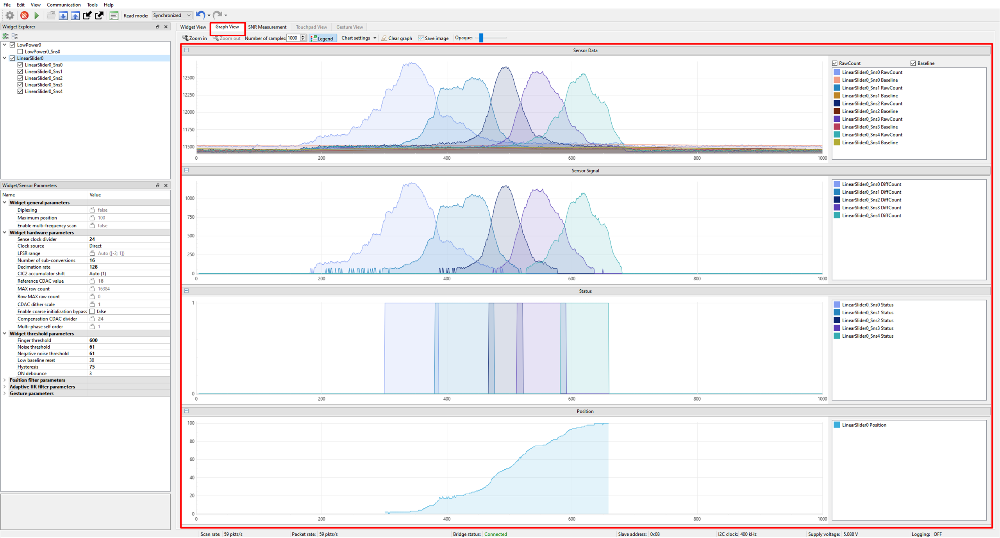
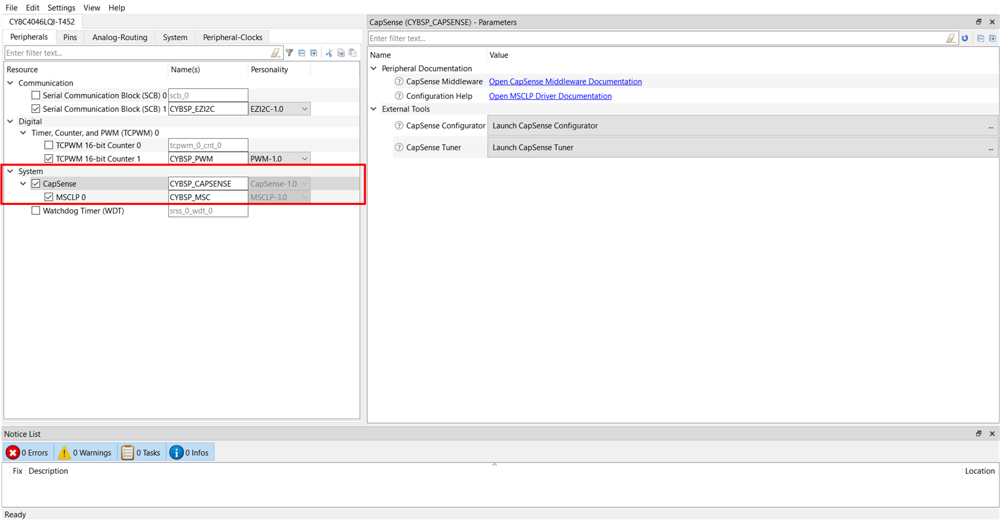
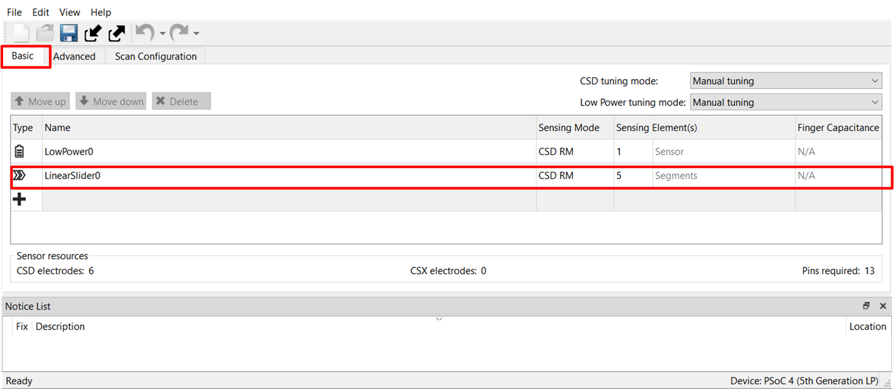
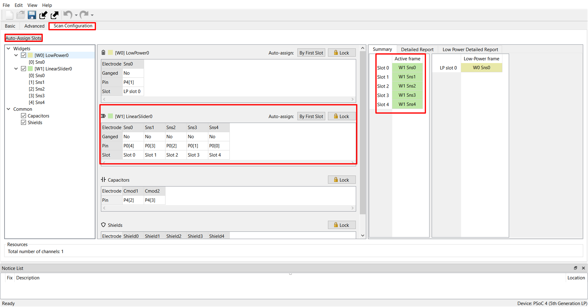
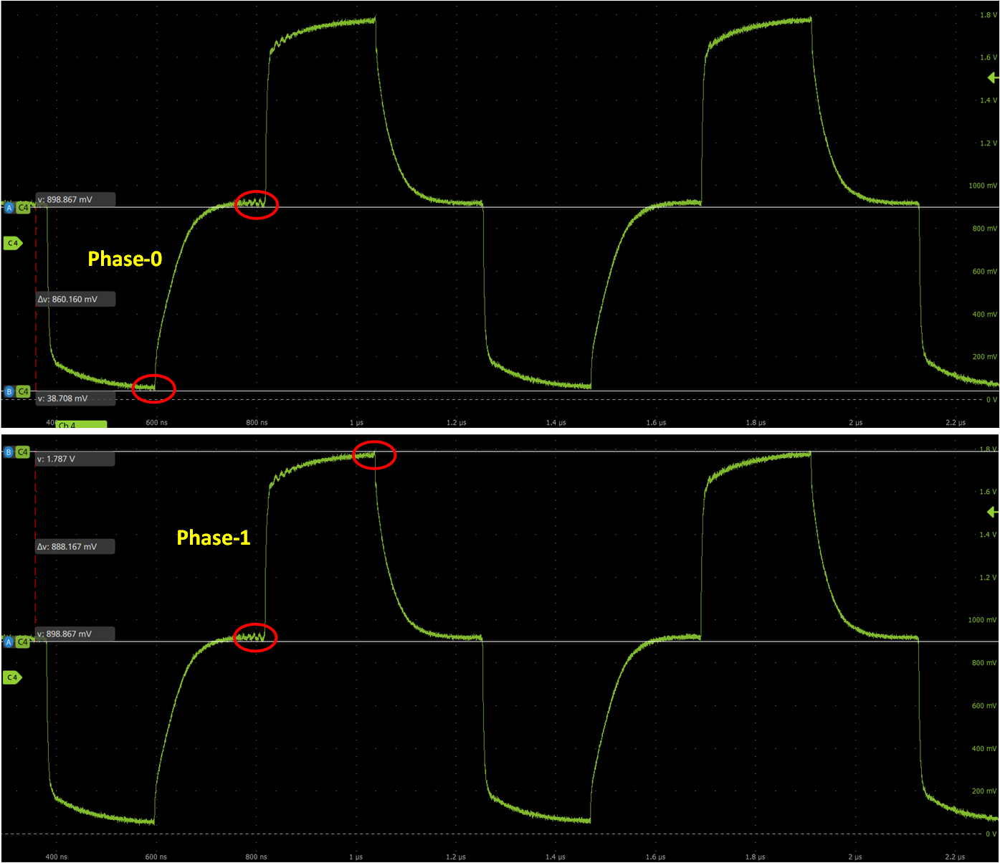
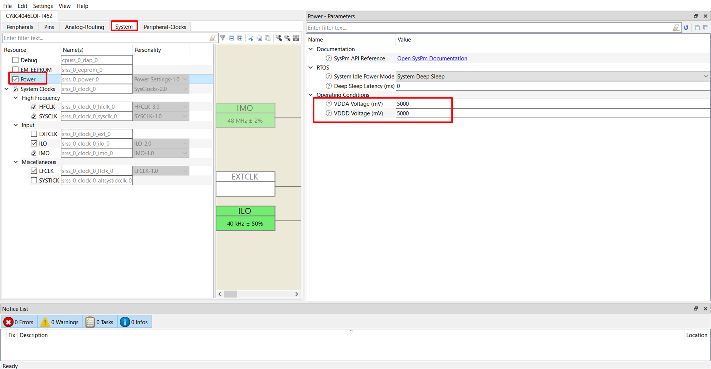
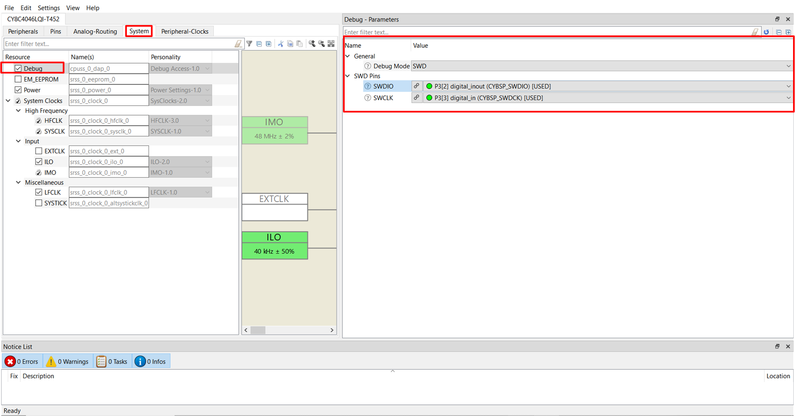
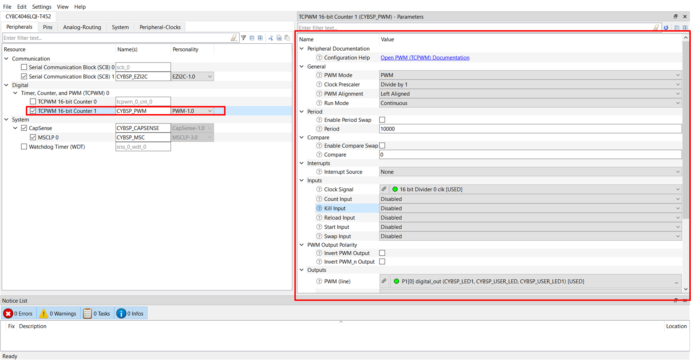

# PSoC&trade; 4: MSCLP low power self-capacitance slider

This code example demonstrates how to use the CAPSENSE&trade; middleware to detect a finger touch position on a self-capacitance-based slider widget in PSoC&trade; 4000T device with multi-sense converter low power (MSCLP).

In addition, this code example also explains how to manually tune the self-capacitance-based slider for optimum performance with respect to parameters such as reliability, power consumption, response time, and linearity using the CSD-RM sensing technique and CAPSENSE&trade; Tuner. Here, CAPSENSE&trade; Sigma Delta (CSD) represents the self-capacitance sensing technique and RM represents the ratiometric method.

[View this README on GitHub.](https://github.com/Infineon/mtb-example-psoc4-msclp-low-power-csd-slider)

[Provide feedback on this code example.](https://cypress.co1.qualtrics.com/jfe/form/SV_1NTns53sK2yiljn?Q_EED=eyJVbmlxdWUgRG9jIElkIjoiQ0UyMzg4MTgiLCJTcGVjIE51bWJlciI6IjAwMi0zODgxOCIsIkRvYyBUaXRsZSI6IlBTb0MmdHJhZGU7IDQ6IE1TQ0xQIGxvdyBwb3dlciBzZWxmLWNhcGFjaXRhbmNlIHNsaWRlciIsInJpZCI6InNpZGhhcnRoYSIsIkRvYyB2ZXJzaW9uIjoiMS4wLjAiLCJEb2MgTGFuZ3VhZ2UiOiJFbmdsaXNoIiwiRG9jIERpdmlzaW9uIjoiTUNEIiwiRG9jIEJVIjoiSUNXIiwiRG9jIEZhbWlseSI6IlBTT0MifQ==)


## Requirements

- [ModusToolbox&trade;](https://www.infineon.com/modustoolbox) v3.1 or later

   **Note:** This code example version requires ModusToolbox&trade; software version 3.1 or later, and is not backward compatible with v3.0 or older versions.

- Board support package (BSP) minimum required version: 3.1.0
- Programming language: C
- Associated parts: [PSoC&trade; 4000T](www.infineon.com/002-33949)

## Supported toolchains (make variable 'TOOLCHAIN')

- GNU Arm&reg; Embedded Compiler v11.3.1 (`GCC_ARM`) – Default value of `TOOLCHAIN`

- Arm&reg; Compiler v6.16 (`ARM`)
- IAR C/C++ Compiler v9.30.1 (`IAR`)

## Supported kits (make variable 'TARGET')

- [PSoC&trade; 4000T CAPSENSE&trade; Prototyping Kit](https://www.infineon.com/CY8CPROTO-040T) (`CY8CPROTO-040T`) - Default `TARGET`

## Hardware setup

This example uses the board's default configuration. See the [Kit user guide](www.infineon.com/002-38600) to ensure that the board is configured correctly to use VDDA at 5 V.

## Software setup

See the [ModusToolbox&trade; tools package installation guide](https://www.infineon.com/ModusToolboxInstallguide) for information about installing and configuring the tools package.

This example requires no additional software or tools.


## Using the code example

### Create the project

The ModusToolbox&trade; tools package provides the Project Creator as both a GUI tool and a command line tool.

<details><summary><b>Use Project Creator GUI</b></summary>

1. Open the Project Creator GUI tool.

   There are several ways to do this, including launching it from the dashboard or from inside the Eclipse IDE. For more details, see the [Project Creator user guide](https://www.infineon.com/ModusToolboxProjectCreator) (locally available at *{ModusToolbox&trade; install directory}/tools_{version}/project-creator/docs/project-creator.pdf*).

2. On the **Choose Board Support Package (BSP)** page, select a kit supported by this code example. See [Supported kits](#supported-kits-make-variable-target).

   > **Note:** To use this code example for a kit not listed here, you may need to update the source files. If the kit does not have the required resources, the application may not work.

3. On the **Select Application** page:

   a. Select the **Applications(s) Root Path** and the **Target IDE**.

   > **Note:** Depending on how you open the Project Creator tool, these fields may be pre-selected for you.

   b.	Select this code example from the list by enabling its check box.

   > **Note:** You can narrow the list of displayed examples by typing in the filter box.

   c. (Optional) Change the suggested **New Application Name** and **New BSP Name**.

   d. Click **Create** to complete the application creation process.

</details>

<details><summary><b>Use Project Creator CLI</b></summary>

The 'project-creator-cli' tool can be used to create applications from a CLI terminal or from within batch files or shell scripts. This tool is available in the *{ModusToolbox&trade; install directory}/tools_{version}/project-creator/* directory.

Use a CLI terminal to invoke the 'project-creator-cli' tool. On Windows, use the command-line 'modus-shell' program provided in the ModusToolbox&trade; installation instead of a standard Windows command-line application. This shell provides access to all ModusToolbox&trade; tools. You can access it by typing "modus-shell" in the search box in the Windows menu. In Linux and macOS, you can use any terminal application.

The following example clones the "[MSCLP low power CSX button tuning](https://github.com/Infineon/mtb-example-psoc4-msclp-low-power-csx-button)" application with the desired name "" configured for the *CY8CPROTO-040T* BSP into the specified working directory, *C:/mtb_projects*:

   ```
   project-creator-cli --board-id CY8CPROTO-040T --app-id mtb-example-psoc4-msclp-low-power-csx-button --user-app-name MSCLP?? --target-dir "C:/mtb_projects"
   ```

The 'project-creator-cli' tool has the following arguments:

Argument | Description | Required/optional
---------|-------------|-----------
`--board-id` | Defined in the <id> field of the [BSP](https://github.com/Infineon?q=bsp-manifest&type=&language=&sort=) manifest | Required
`--app-id`   | Defined in the <id> field of the [CE](https://github.com/Infineon?q=ce-manifest&type=&language=&sort=) manifest | Required
`--target-dir`| Specify the directory in which the application is to be created if you prefer not to use the default current working directory | Optional
`--user-app-name`| Specify the name of the application if you prefer to have a name other than the example's default name | Optional

> **Note:** The project-creator-cli tool uses the `git clone` and `make getlibs` commands to fetch the repository and import the required libraries. For details, see the "Project creator tools" section of the [ModusToolbox&trade; tools package user guide](https://www.infineon.com/ModusToolboxUserGuide) (locally available at {ModusToolbox&trade; install directory}/docs_{version}/mtb_user_guide.pdf).

</details>


### Open the project

After the project has been created, you can open it in your preferred development environment.


<details><summary><b>Eclipse IDE</b></summary>

If you opened the Project Creator tool from the included Eclipse IDE, the project will open in Eclipse automatically.

For more details, see the [Eclipse IDE for ModusToolbox&trade; user guide](https://www.infineon.com/MTBEclipseIDEUserGuide) (locally available at *{ModusToolbox&trade; install directory}/docs_{version}/mt_ide_user_guide.pdf*).

</details>


<details><summary><b>Visual Studio (VS) Code</b></summary>

Launch VS Code manually, and then open the generated *{project-name}.code-workspace* file located in the project directory.

For more details, see the [Visual Studio Code for ModusToolbox&trade; user guide](https://www.infineon.com/MTBVSCodeUserGuide) (locally available at *{ModusToolbox&trade; install directory}/docs_{version}/mt_vscode_user_guide.pdf*).

</details>


<details><summary><b>Keil µVision</b></summary>

Double-click the generated *{project-name}.cprj* file to launch the Keil µVision IDE.

For more details, see the [Keil µVision for ModusToolbox&trade; user guide](https://www.infineon.com/MTBuVisionUserGuide) (locally available at *{ModusToolbox&trade; install directory}/docs_{version}/mt_uvision_user_guide.pdf*).

</details>


<details><summary><b>IAR Embedded Workbench</b></summary>

Open IAR Embedded Workbench manually, and create a new project. Then select the generated *{project-name}.ipcf* file located in the project directory.

For more details, see the [IAR Embedded Workbench for ModusToolbox&trade; user guide](https://www.infineon.com/MTBIARUserGuide) (locally available at *{ModusToolbox&trade; install directory}/docs_{version}/mt_iar_user_guide.pdf*).

</details>


<details><summary><b>Command line</b></summary>

If you prefer to use the CLI, open the appropriate terminal, and navigate to the project directory. On Windows, use the command-line 'modus-shell' program; on Linux and macOS, you can use any terminal application. From there, you can run various `make` commands.

For more details, see the [ModusToolbox&trade; tools package user guide](https://www.infineon.com/ModusToolboxUserGuide) (locally available at *{ModusToolbox&trade; install directory}/docs_{version}/mtb_user_guide.pdf*).

</details>


## Operation

1. Connect the board to your PC using the provided USB cable through the KitProg3 USB connector as follows:

   **Figure 1. Connecting the [CY8CPROTO-040T](https://www.infineon.com/CY8CPROTO-040T) kit with the PC**

   

2. Program the board using one of the following:

   <details><summary><b>Using Eclipse IDE</b></summary>

      1. Select the application project in the Project Explorer.

      2. In the **Quick Panel**, scroll down, and click **\<Application Name> Program (KitProg3_MiniProg4)**.
   </details>


   <details><summary><b>In other IDEs</b></summary>

   Follow the instructions in your preferred IDE.
   </details>


   <details><summary><b>Using CLI</b></summary>

     From the terminal, execute the `make program` command to build and program the application using the default toolchain to the default target. The default toolchain is specified in the application's Makefile but you can override this value manually:
      ```
      make program TOOLCHAIN=<toolchain>
      ```

      Example:
      ```
      make program TOOLCHAIN=GCC_ARM
      ```
   </details>

3. After programming, the application starts automatically.

   >**Note:** After programming, you see the following error message if debug mode is disabled. Ignore the error or enable the debug mode to solve this error.<br>

   ``` c
   "Error: Error connecting Dp: Cannot read IDR"
   ```

4. To test the application, slide your finger over the CAPSENSE&trade; slider and notice that the LED3 turn ON when touched and turn OFF when the finger is lifted. The LED3 brightness increases when the finger is swiped from left to right.

5. You can also monitor the CAPSENSE&trade; data using the CAPSENSE&trade; Tuner application as follows:

    **Monitor data using CAPSENSE&trade; Tuner**

    1. Open CAPSENSE&trade; Tuner from the tools section in the IDE **Quick Panel**.

        You can also run the CAPSENSE&trade; Tuner application in standalone mode from *{ModusToolbox&trade; install directory}/ModusToolbox/tools_{version}/capsense-configurator/capsense-tuner*. In this case, after opening the application, select **File** > **Open** and open the *design.cycapsense* file of the respective application, which is present in the *{Application root directory}/bsps/TARGET_APP_\<BSP-NAME>/config/* folder.

	     See the [ModusToolbox&trade; user guide](https://www.infineon.com/ModusToolboxUserGuide) {locally available at *ModusToolbox&trade; install directory}/docs_{version}/mtb_user_guide.pdf* for options to open the CAPSENSE&trade; Tuner application using the CLI.

    2. Ensure that the kit is in CMSIS-DAP bulk mode (KitProg3 status LED is ON and not blinking). See [Firmware-loader](https://github.com/Infineon/Firmware-loader) to learn how to update the firmware and switch modes in KitProg3.

    3. In the tuner application, click on the **Tuner Communication Setup** icon or select **Tools** > **Tuner Communication Setup**. In the window, select the I2C checkbox under KitProg3 and configure as follows:

       - **I2C address:** 8
       - **Sub-address:** 2 bytes
       - **Speed (kHz):** 400

         These are the same values set in the EZI2C resource.

      **Figure 2. Tuner communication setup parameters**

      

6. Click **Connect** or select **Communication** > **Connect** to establish a connection.

   **Figure 3. Establish a connection**

   

7. Click **Start** or select **Communication** > **Start** to start data streaming from the device.

   **Figure 4. Start tuner communication**

   

   The tuner displays the data from the sensor in the **Widget View**, **Graph View**, and **Touchpad View** tabs.

8. Set **Read mode** to **Synchronized** mode. Under the **Widget View** tab, you can see the **LinearSlider0** widget highlighted in **Blue** when you touch it, as shown in Figure 5.

   **Figure 5. Widget view of the CAPSENSE&trade; Tuner**

   

9. You can view the raw count, baseline, difference count, status for each sensor, and slider position in the **Graph View** tab. For example, to view the sensor data for LinearSlider0, select **LinearSlider0_Sns0** under **LinearSlider0**.

   **Figure 6. Graph View tab of the CAPSENSE&trade; Tuner**

   

10. See the **Widget/Sensor Parameters** section in the CAPSENSE&trade; Tuner window. The configuration parameters for each slider sensor element calculated by the CAPSENSE&trade; resource are displayed, as shown in Figure 6.

11. Verify that the SNR is greater than 5:1 and the signal count is above 50 by following the steps given in [Stage 4:  Obtain noise and crossover point](#stage-4-obtain-noise-and-crossover-point).

Non-reporting of false touches and the linearity of the position graph indicate proper tuning.

## Operation at other voltages

[CY8CPROTO-040T kit](https://www.infineon.com/CY8CPROTO-040T) supports operating voltages of 1.8 V, 3.3 V and 5 V. Refer to the [Kit user guide](www.infineon.com/002-38600) to set the preferred operating voltage and refer to section [setup the VDDA supply voltage and Debug mode](#set-up-the-vdda-supply-voltage-and-debug-mode-in-device-configurator).

This application functionalities are optimally tuned for 5 V. However, basic functionalities works on other voltages. 

For better performance, it is recommended to tune application for the preferred voltages.

## Tuning procedure

<details><summary><b> Create a custom BSP for your board </b></summary>

1. Create a custom BSP for your board having any device, by following the steps given in [ModusToolbox&trade; BSP Assistant user guide](https://www.infineon.com/ModusToolboxBSPAssistant). This code example was created for the device "CY8C4046LQI-T452".

2. Open the *design.modus* file from the *{Application root directory}/bsps/TARGET_APP_\<BSP-NAME>/config/* folder obtained in the previous step and enable CAPSENSE&trade; to get the *design.cycapsense* file. CAPSENSE&trade; configuration can then be started from scratch as explained below.

</details>
The following steps explain the tuning procedure.

>**Note:** See the section "Selecting CAPSENSE&trade; hardware parameters" in the [PSoC&trade; 4 and PSoC&trade; 6 MCU CAPSENSE&trade; design guide](https://www.infineon.com/AN85951) to learn about the considerations for selecting each parameter value.

**Figure 7. CSD slider widget tuning flow**


Do the following to tune the slider widget:

- [Stage 1: Set the initial hardware parameters](#stage-1-set-the-initial-hardware-parameters)

- [Stage 2: Measure Sensor Capacitance to set CDAC Dither](#stage-2-measure-sensor-capacitance-to-set-cdac-dither)

- [Stage 3: Set the Sense clock frequency](#stage-3-set-the-sense-clock-frequency)

- [Stage 4:  Obtain noise and crossover point](#stage-4-obtain-noise-and-crossover-point)

- [Stage 5: Fine-tune sensitivity to achieve 5:1 SNR](#stage-5-fine-tune-sensitivity-to-achieve-51-snr)

- [Stage 6: Tune threshold parameters](#stage-6-tune-threshold-parameters)


### Stage 1: Set the initial hardware parameters
------------

1. Connect the board to your PC using the provided USB cable through the KitProg3 USB connector.

2. Launch the Device Configurator tool.

   You can launch the Device Configurator in Eclipse IDE for ModusToolbox&trade; from the **Tools** section in the IDE **Quick Panel** or in standalone mode from *{ModusToolbox&trade; install directory}/ModusToolbox/tools_{version}/device-configurator/device-configurator*. In this case, after opening the application, select **File** > **Open** and open the *design.modus* file of the respective application, which is present in the *{Application root directory}/bsps/TARGET_APP_\<BSP-NAME>/config/* folder.

3. In the [PSoC&trade; 4000T Prototyping Kit](https://www.infineon.com/CY8CPROTO-040T), the slider pins are connected to CAPSENSE&trade; channel (MSCLP 0). Therefore, make sure that you enable CAPSENSE&trade; channel in the Device Configurator, as shown in Figure 8.

   **Figure 8. Enable MSCLP channel in the Device Configurator**

   

   Save the changes and close the window.

4. Launch the CAPSENSE&trade; Configurator tool.

   You can launch the CAPSENSE&trade; Configurator tool in the Eclipse IDE for ModusToolbox&trade; from the CAPSENSE&trade; peripheral setting in the Device Configurator or directly from the **Tools** section in the IDE **Quick Panel**. You can also launch it in standalone mode from *{ModusToolbox&trade; install directory}/ModusToolbox/tools_{version}/capsense-configurator/capsense-configurator*. In this case, after opening the application, select **File** > **Open** and open the *design.cycapsense* file of the respective application, which is present in the *{Application root directory}/bsps/TARGET_APP_\<BSP-NAME>/config/* folder.

   See the [ModusToolbox&trade; CAPSENSE&trade; Configurator tool guide](https://www.infineon.com/ModusToolboxCapSenseConfig) for step-by-step instructions on how to configure and launch CAPSENSE&trade; in ModusToolbox&trade;.

5. In the **Basic** tab, note that the slider 'LinearSlider0' is configured with CSD RM (self-cap) Sensing mode. A low power widget 'LowPower0' is also configured to scan in the Wake-on-Touch(WOT) mode.

   **Figure 9. CAPSENSE&trade; Configurator - Basic tab**

   

6. Do the following in the **General** tab under the **Advanced** tab:

   1. Select **CAPSENSE&trade; IMO clock frequency** as 46 MHz.

   2. Set **Modulator clock divider** to '1' to obtain the maximum available modulator clock frequency as recommended in the [PSoC&trade; 4 and PSoC&trade; 6 MCU CAPSENSE&trade; design guide](https://documentation.infineon.com/html/psoc6/epf1667481159393.html).

      >**Note:** The modulator clock frequency can be set to 46,000 kHz after changing the CAPSENSE&trade; IMO clock frequency to 46 MHz, because the modulator clock is derived from the CAPSENSE&trade; IMO clock. In the **CAPSENSE&trade; IMO clock frequency** drop-down list, select **46 MHz**.

   3. **Number of init sub-conversions** is set based on the hint shown when you hover over the edit box. Retain the default value.

   4. It is recommended to **Enable IIR filter (first order)** and set the **IIR filter raw count coefficient** to '128' when the CIC2 filter is enabled. You can enable the filters later depending on the signal-to-noise ratio (SNR) requirements in [Stage 5: Fine-tune sensitivity to achieve 5:1 SNR](#stage-5-fine-tune-sensitivity-to-achieve-51-snr).

      Filters are used to reduce the peak-to-peak noise. Using filters will result in a longer scan time.

   **Figure 10. CAPSENSE&trade; Configurator – General settings**

   

   >**Note:** Each tab has a **Restore Defaults** button to restore the parameters of that tab to their default values.

7. Go to the **CSD Settings** tab and make the following changes:

   - Set **Inactive sensor connection** as **Shield**.

      Inactive sensors connected to Shield provide better performance in terms of SNR and refresh rate (as the use of shield results in a reduction of sensor Cp) and can also be used if your design requires liquid tolerance.

   - Set **Shield mode** to **Active**.

      MSCLP provides active and passive shielding. Active shielding is preferred for high-performance applications. Before enabling this option, ensure that the design has shield electrodes.

   - Set **Total shield count** as **5**.

      This is equal to the number of shield electrodes in your design. It is zero when only the inactive sensors are shielded.

   - Select **Enable CDAC auto-calibration** and **Enable compensation CDAC**.

      This helps in achieving the required CDAC calibration levels (65% of the maximum count) for all sensors in the widget while maintaining the same sensitivity across the sensor elements.

   - Select **Enable CDAC dither**.

      This helps in removing flat-spots by adding white noise that moves the conversion point around the flat-spot region.

   **Figure 11. CAPSENSE&trade; Configurator – Advanced CSD settings**

   

8. Go to the **Widget Details** tab. Select **LinearSlider0** from the left pane, and then set the following:

   1. **Maximum postion** :Set to 100.

   2. **Sense clock divider:** Retain the default value (will be set in [Stage 3: Set the sense clock frequency](#stage-3-set-the-sense-clock-frequency)).

   3. **Clock source:** **Direct**

      >**Note:** Spread Spectrum Clock (SSC) or PRS clock can be used as a clock source to deal with EMI/EMC issues.

   4. **Number of sub-conversions:** 12

     12 is an appropriate starting point to ensure a fast scan time and sufficient signal. This value will be adjusted as required in [Stage 5: Fine-tune sensitivity to achieve 5:1 SNR](#stage-5-fine-tune-sensitivity-to-achieve-51-snr).

   6. **Finger threshold:** 20

     Finger threshold is initially set to a low value, allowing to track the finger movement during tuning.

   7. **Noise threshold:** 10

   8. **Negative noise threshold:** 10

   9. **Hysteresis:** 5

     These values reduce the influence of the baseline on the sensor signal, which helps to get the true difference count. Retain the default values for all other threshold parameters; these parameters are set in [Stage 6: Tune threshold parameters](#stage-6-tune-threshold-parameters).

   **Figure 12. CAPSENSE&trade; Configurator - Widget details settings**

   

9. Go to the **Scan Configuration** tab to select the pins, the scan slots, and do the following:

   **Figure 13. Scan Configuration tab**

   

   1. Configure pins for the electrodes using the drop-down menu.

   2. Configure the scan slots using the **Auto-assign Slots** option.

      The summary section in the **Scan configuration** tab shows five scan slots (for five sensors). Each sensor is allotted a scan slot based on the slot number.

   3. Check the notice list for warnings or errors.

      >**Note:** Enable the **Notice List** from the **View** menu if the notice list is not visible.

10. Click **Save** to apply the settings.

### Stage 2: Measure sensor capacitance to set CDAC Dither
------------

The CAPSENSE&trade; middleware provides Built-In Self Test (BIST) API's to measure the capacitances of sensors configured in the application. The sensor capacitances are referred to as  **C<sub>p</sub>** for CSD sensors and **C<sub>m</sub>** for CSX sensor.

The steps to measure the C<sub>p</sub>/C<sub>m</sub> using BIST are as follows.

   1.	Open CAPSENSE&trade; Configurator from the **Quick Panel** and enable the BIST library.

   **Figure 14. Enabling self test library**

   

   2.	Get the capacitance(C<sub>p</sub>/C<sub>m</sub>) by following these steps:
        - Add breakpoint at the function call "measure_sensor_capacitance()" function in main.c
        - Run the application in debug mode
        - Click **Step over** button once break point hits
        - Add array variable sensor_capacitance to **Expressions view** tab, which holds the measured Cp values of sensors configured

   **Figure 15. Measure C<sub>p</sub>/C<sub>m</sub> using BIST**

   
   
   3.	The index of the sensor_capacitance array matches the sensor configuration in CAPSENSE&trade; Configurator, as shown in Figure 16.

   **Figure 16. Cp array index alignment**

   

   

   4. Refer to [CAPSENSE&trade; library and documents](https://github.com/Infineon/capsense)  for more details about BIST.
   5. Keep this feature disabled in CAPSENSE&trade; Configurator, if it is not used in the application.

**CDAC Dither scale setting**

MSCLP uses CDAC dithering to reduce flat spots. Select the optimal dither scale parameter based on the sensor capacitance measured using BIST library.

See the following table for general recommended values of the Dither scale.

**Table 1. Dither scale recommendation for CSD sensors**
 
Parasitic capacitance (C<sub>p</sub>) | Scale
:---: | :---:  
2pF <= C<sub>p</sub> < 3pF | 3
3pF <= C<sub>p</sub> < 5pF | 2
5pF <= C<sub>p</sub> < 10pF | 1
 C<sub>p</sub> >= 10pF  | 0

<br>

**Table 2. Dither scale recommendation for CSX sensors**
 
Mutual capacitance (C<sub>m</sub>) | Scale
:---: | :---:  
300fF <= C<sub>m</sub> < 500fF | 5
500fF <= C<sub>m</sub> < 1000fF | 4
1000fF <= C<sub>m</sub> < 2000fF | 3
C<sub>m</sub> >= 2pF  | Follow [Table 1](#Table-1.-Dither-Scale-Recommendation-for-CSD-Sensors)

 Set the scale value in CAPSENSE&trade; Configurator as follows.

**Figure 17. CDAC Dither scale setting**

   


### Stage 3: Set the sense clock frequency
-----------------

The sense clock is derived from the modulator clock using a clock-divider and is used to scan the sensor by driving the CAPSENSE&trade; switched capacitor circuits. Both the clock source and clock divider are configurable. The sense clock divider should be configured such that the pulse width of the sense clock is long enough to allow the sensor capacitance to charge and discharge completely. This is verified by observing the charging and discharging waveforms of the sensor using an oscilloscope and an active probe. The sensors should be probed close to the electrode and not at the sense pins or the series resistor. 

See [Figure 18](#figure-18-proper-charge-cycle-of-a-sensor) and [Figure 19](#figure-19-improper-charge-cycle-of-a-sensor) for waveforms observed on the shield. [Figure 18](#figure-18-proper-charge-cycle-of-a-sensor) shows proper charging when the sense clock frequency is correctly tuned. The pulse width is at least 5 Tau, i.e., the voltage is reaching at least 99.3% of the required voltage at the end of each phase. [Figure 19](#figure-19-improper-charge-cycle-of-a-sensor) shows incomplete settling (charging/discharging).


**Figure 18. Proper charge cycle of a sensor**



<br>

**Figure 19. Improper charge cycle of a sensor**


1. Program the board and launch CAPSENSE&trade; Tuner.

2. See the charging waveform of the sensor as described earlier. 

3. If the charging is incomplete, increase the sense clock divider. This can be done in CAPSENSE&trade; Tuner by selecting the Sensor and editing the sense clock divider parameter in the Widget/Sensor Parameters panel.

   >**Note:** The sense clock divider should be **divisible by 4**. This ensures that all four scan phases have equal durations. 

   After editing the value, click the **Apply to Device** button and observe the waveform again. Repeat this until complete settling is observed.  
   
4. Click the **Apply to Project** button to save the configuration to your project. 

   **Figure 20. Sense Clock Divider setting**

   
   

5. Repeat this process for all the sensors and the Shield. Each sensor may require a different sense clock divider value to charge/discharge completely. But all the sensors that are in the same scan slot need to have the same sense clock source, sense clock divider, and number of sub-conversions. Therefore, take the largest sense clock divider in a given scan slot and apply it to all the other sensors that share that slot.


### Stage 4: Obtain noise and crossover point 
---------------

1. Program the board.

2. Launch the CAPSENSE&trade; Tuner to monitor the CAPSENSE&trade; data and for CAPSENSE&trade; parameter tuning and SNR measurement.

   See the [CAPSENSE&trade; Tuner guide](https://www.infineon.com/ModusToolboxCapSenseTune) for step-by-step instructions on how to launch and configure the CAPSENSE&trade; Tuner in ModusToolbox&trade; software.

3. Capture and note the peak-to-peak noise of each segment of the slider.
   1. From the **Widget Explorer** section, select a sensor (for example, **LinearSlider0_Sns0**).
   2. Go to the **SNR Measurement** tab and click **Acquire Noise** to capture peak-to-peak noise, as shown in Figure 21. 
   
      **Figure 21. Noise obtained on the SNR Measurement tab in Tuner window** 
       
      
   3. Repeat Steps 1 and 2 for all the sensors to capture peak-to-peak noise.

      **Table 3. Peak-to-peak noise obtained for each segment**

       Slider segment | Peak-to-peak noise (CY8CPROTO-040T)
       :--------- | :------------     
       SNS0 | 45   
       SNS1 | 28   
       SNS2 | 61   
       SNS3 | 35  
       SNS4 | 34    

<br>

4.  Use a grounded metal finger and swipe it slowly at a constant speed from the start to the end of the slider.
    1. Go to the **Graph View** tab to view a graph similar to Figure 23. 
    2. Get the upper crossover point (UCP) and lower crossover point (LCP), as shown in Figure 23.

       **Figure 22. Difference count (delta) vs. finger position** 

    

    Sensor signal values at points a, b, c, and d are expected to be at approximately the same level. If the values are slightly different, consider the lowest value as the UCP.

    Sensor signal values at points q, r, and s are expected to be at approximately the same level. If the values are slightly different, consider the lowest value as the LCP.

    **Figure 23. Sensor signal (difference counts) displayed in the Graph View tab**

    

   >**Note:** In this example, for tuning, a 6mm metal finger is used.
</details>

### Stage 5: Fine-tune sensitivity to achieve 5:1 SNR
------------------
The CAPSENSE&trade; system may be required to work reliably in adverse conditions such as a noisy environment. Tune the slider segments with SNR > 5:1 to avoid triggering false touches and ensure that all intended touches are registered in these adverse conditions.

1. Ensure that all UCPs meet at least 5:1 SNR (using **Equation 1**) and all LCPs are greater than twice the peak-to-peak noise for all slider segments.

   In the **CAPSENSE&trade; Tuner** window, increase the **Number of sub-conversions** (located in the **Widget/Sensor Parameters** section, under **Widget Hardware Parameters**) by 10 until you achieve at least 5:1 SNR.

   **Equation 1. SNR equation** 

   


2. Update the number of sub-conversions.

   1. Update the number of sub-conversions (Nsub) directly in the **Widget/Sensor parameters** tab of the CAPSENSE&trade; Tuner.

   2. [CY8CPROTO-040T](https://www.infineon.com/CY8CPROTO-040T) has an in-built CIC2 filter which increases the resolution for the same scan time. See [AN234231 - Achieving lowest-power capacitive sensing with PSoC&trade; 4000T](https://www.infineon.com/AN234231) for detailed information on the CIC2 filter.

   3. Current consumption is directly proportional to the number of sub-conversions; therefore, decrease the number of sub-conversions to achieve lower current consumption.

   4. Calculate the decimation rate using **Equation 2**. Resolution increases with an increase in decimation rate; therefore, set the maximum decimation rate.

      **Equation 2. Decimation rate**

      

3. After changing the **Number of sub-conversions**, click **Apply to Device** to send the setting to the device. The change is reflected in the graphs.

   >**Note:** The **Apply to Device** option is enabled only when the **Number of sub-conversions** is changed.

    >**Note:** Decrease the IIR filter coefficient if 5:1 SNR is not being achieved even with maximum Nsub.


### Stage 6: Tune threshold parameters
---------------


   After confirming that your design meets the timing parameters and the SNR is greater than 5:1, set the threshold parameters as follows:

  1. Set the recommended threshold values for the Slider widget using the LCP and UCP obtained in **Stage 5**:
   - **Finger Threshold** – 80% of UCP
   - **Noise Threshold** – Minimum (twice the peak-to-peak noise, LCP)
   - **Negative Noise Threshold** – Minimum (twice the peak-to-peak noise, LCP)
   - **Low Baseline Reset** - Default value of 30
   - **Hysteresis** – 10% of UCP
   - **ON Debounce** – Default value of 3

   **Table 4. Software tuning parameters** 
  
   Parameter|	 CY8CPROTO-040T
   :--------|:------
   Number of sub-conversions	| 16	 
   Finger threshold 	| 600 
   Noise threshold |61
   Negative noise threshold	|61 
   Low baseline reset	| 30   
   Hysteresis	| 75  
   ON debounce	|3 
   
   <br>
   
## Tuning parameters
This code example has the tuning flow explained for the CSD slider widget. See CE238886 [PSoC™ 4: MSCLP Low Power CSD Button](https://github.com/Infineon/mtb-example-psoc4-msclp-low-power-csd-button) for tuning the low-power widget.

### Apply the settings to the firmware

1. Click **Apply to Device** and **Apply to Project** in the CAPSENSE&trade; Tuner window to apply the settings to the device and project, respectively. Close the tuner.

   **Figure 24. Apply to project**

   

   The change is updated in the *design.cycapsense* file and reflected in the CAPSENSE&trade; Configurator.

## Measure current at different power modes

1. Disable the run-time measurement, serial LED, and tuner macros to measure the current used for CAPSENSE&trade; sensing in each power mode in *main.c*, and disable the self-test library from the CAPSENSE&trade; Configurator as follows:

   ```
      #define ENABLE_RUN_TIME_MEASUREMENT      (0u)
      
      #define ENABLE_PWM_LED                   (0u)

      #define ENABLE_TUNER                     (0u)
    ```
    
   **Figure 25. Disable self test library**

   
2.  To evaluate the low-power feature of the device, connect the kit to a Power Analyzer (for example, KEYSIGHT - N6705C) using a current measure header, as shown in the following figure:

   **Figure 26. Power analyzer connection**

   

3. Use "Keysight BenchVue Advanced Power Control and Analysis" software to control the power analyzer device through the PC.

4. Select the **Current Measure** option from the Instrument Control setup. Then, select and turn ON the output channel, as shown in the following figure:

   **Figure 27. Current measurement setup**

   

5. Capture the data using the **Data logger** option from the tool. The average current consumption is measured using cursors on each power mode, as shown in the following figure.

   **Figure 28. Current measurement**

   

6. After reset, the application transitions to low-power state if there is no user activity (for example, button touch detection) to reduce the power consumption, as shown in the following figure.

   **Figure 29. Power mode transition - no user activity**
   
   

7. If there is a touch detection while in low-power state, the application transitions to Active mode with the highest refresh rate as follows:


   **Table 5. Measured current for different modes**

    Power mode   |Refresh rate (Hz) | Current consumption (µA)
   :--------------------------|:-----:|:-----:
    Active    |128 |130
    Active Low Refresh rate <br>(ALR)|32 |32
    Wake on Touch <br>(WoT)|16 |3.8
    
    <br>
    
>**Note :** 
The earlier WoT current was measured on a kit with 1.7 µA Deep Sleep current. If the kit has a Deep Sleep current of 2.5 µA (typical), the WoT current is expected to be ~4.6 µA.

## Debugging

You can debug the example to step through the code.


<details><summary><b>In Eclipse IDE</b></summary>

Use the **\<Application Name> Debug (KitProg3_MiniProg4)** configuration in the **Quick Panel**. For details, see the "Program and debug" section in the [Eclipse IDE for ModusToolbox&trade; user guide](https://www.infineon.com/MTBEclipseIDEUserGuide).

</details>


<details><summary><b>In other IDEs</b></summary>

Follow the instructions in your preferred IDE.
</details>

## Design and implementation

The project contains a slider widget configured in CSD-RM sensing mode. See the [Tuning procedure](#tuning-procedure) section for step-by-step instructions to configure the other settings of the CAPSENSE&trade; Configurator.

The project uses the [CAPSENSE&trade; middleware](https://github.com/Infineon/capsense) (see ModusToolbox&trade; user guide for more details on selecting a middleware). See [AN85951 – PSoC&trade; 4 and PSoC&trade; 6 MCU CAPSENSE&trade; design guide](https://www.infineon.com/AN85951) for more details on CAPSENSE&trade; features and usage.

The [ModusToolbox&trade; software](https://www.infineon.com/modustoolbox) provides a GUI-based tuner application for debugging and tuning the CAPSENSE&trade; system. The CAPSENSE&trade; Tuner application works with EZI2C and UART communication interfaces. This project has an SCB block configured in EZI2C mode to establish communication with the onboard KitProg, which in turn enables reading the CAPSENSE&trade; raw data by the CAPSENSE&trade; Tuner.

The CAPSENSE&trade; data structure that contains the CAPSENSE&trade; raw data is exposed to the CAPSENSE&trade; Tuner by setting up the I2C communication data buffer with the CAPSENSE&trade; data structure. This enables the tuner to access the CAPSENSE&trade; raw data for tuning and debugging CAPSENSE&trade;.

The successful tuning of the slider is indicated by the LED3 in the Prototyping Kit; the LED3 brightness increases when the finger is swiped from left to right.

The PWM pin is used for controlling brightness, and ON or OFF operation of the LED3.


### Steps to set up the VDDA supply voltage in Device Configurator

1. Open Device Configurator from the **Quick Panel**.

2. Go to the **System** tab. Select the **Power** resource and set the VDDA value under **Operating Conditions**, as shown in Figure 30.

   **Figure 30. Setting the VDDA supply in the system tab of Device Configurator**

   

3. By default, Debug mode is disabled for this application to reduce power consumption. Enable Debug mode to enable SWD pins as follows:

   **Figure 31. Enable Debug mode in the System tab of Device Configurator**

   


### Resources and settings

**Figure 32. EZI2C settings**


<br>

**Figure 33. PWM settings**



<br>

**Table 6. Application resources**

| Resource  |  Alias/object     |    Purpose     |
| :------- | :------------    | :------------ |
| SCB (EZI2C) (PDL) | CYBSP_EZI2C          | EZI2C slave driver to communicate with CAPSENSE&trade; Tuner |
| CAPSENSE&trade; | CYBSP_MSC | CAPSENSE&trade; driver to interact with the MSCLP hardware and interface the CAPSENSE&trade; sensors |
| Digital pin     | CYBSP_PWM | To show the slider operation|


### Firmware flow

**Figure 34. Firmware flowchart**


<br>

## Related resources

Resources  | Links
-----------|----------------------------------
Application notes  | [AN79953](https://www.infineon.com/AN79953) – Getting started with PSoC&trade; 4 <br> [AN85951](https://www.infineon.com/AN85951) – PSoC&trade; 4 and PSoC&trade; 6 MCU CAPSENSE&trade; design guide <br> [AN234231](https://www.infineon.com/AN234231) - Achieving lowest-power capacitive sensing with PSoC&trade; 4000T
Code examples | [Using ModusToolbox&trade; software](https://github.com/Infineon/Code-Examples-for-ModusToolbox-Software) on GitHub
Device documentation | [PSoC&trade; 4 datasheets](https://www.infineon.com/cms/en/search.html#!term=psoc%204%20datasheet&view=all) <br>[PSoC&trade; 4 technical reference manuals](https://www.infineon.com/cms/en/search.html#!term=psoc%204%20TRM&view=all)
Development kits | Select your kits from the [Evaluation board finder](https://www.infineon.com/cms/en/design-support/finder-selection-tools/product-finder/evaluation-board).
Libraries on GitHub  | [mtb-hal-cat2](https://github.com/Infineon/mtb-hal-cat2) – Hardware Abstraction Layer (HAL) library
Middleware on GitHub | [capsense](https://github.com/Infineon/capsense) – CAPSENSE&trade; library and documents <br>
Tools  | [ModusToolbox&trade;](https://www.infineon.com/modustoolbox) – ModusToolbox&trade; software is a collection of easy-to-use libraries and tools enabling rapid development with Infineon MCUs for applications ranging from wireless and cloud-connected systems, edge AI/ML, embedded sense and control, to wired USB connectivity using PSoC&trade; Industrial/IoT MCUs, AIROC&trade; Wi-Fi and Bluetooth&reg; connectivity devices, XMC&trade; Industrial MCUs, and EZ-USB&trade;/EZ-PD&trade; wired connectivity controllers. ModusToolbox&trade; incorporates a comprehensive set of BSPs, HAL, libraries, configuration tools, and provides support for industry-standard IDEs to fast-track your embedded application development.

<br>


## Other resources

Infineon provides a wealth of data at [www.infineon.com](https://www.infineon.com) to help you select the right device, and quickly and effectively integrate it into your design.


## Document history

Document title: *CE238818* - *PSoC&trade; 4: MSCLP low power self-capacitance slider*

| Version | Description of change |
| ------- | --------------------- |
| 1.0.0   | New code example.

------

All referenced product or service names and trademarks are the property of their respective owners.

-------------------------------------------------------------------------------

© Cypress Semiconductor Corporation, 2023. This document is the property of Cypress Semiconductor Corporation, an Infineon Technologies company, and its affiliates ("Cypress").  This document, including any software or firmware included or referenced in this document ("Software"), is owned by Cypress under the intellectual property laws and treaties of the United States and other countries worldwide.  Cypress reserves all rights under such laws and treaties and does not, except as specifically stated in this paragraph, grant any license under its patents, copyrights, trademarks, or other intellectual property rights.  If the Software is not accompanied by a license agreement and you do not otherwise have a written agreement with Cypress governing the use of the Software, then Cypress hereby grants you a personal, non-exclusive, nontransferable license (without the right to sublicense) (1) under its copyright rights in the Software (a) for Software provided in source code form, to modify and reproduce the Software solely for use with Cypress hardware products, only internally within your organization, and (b) to distribute the Software in binary code form externally to end users (either directly or indirectly through resellers and distributors), solely for use on Cypress hardware product units, and (2) under those claims of Cypress's patents that are infringed by the Software (as provided by Cypress, unmodified) to make, use, distribute, and import the Software solely for use with Cypress hardware products.  Any other use, reproduction, modification, translation, or compilation of the Software is prohibited.
<br>
TO THE EXTENT PERMITTED BY APPLICABLE LAW, CYPRESS MAKES NO WARRANTY OF ANY KIND, EXPRESS OR IMPLIED, WITH REGARD TO THIS DOCUMENT OR ANY SOFTWARE OR ACCOMPANYING HARDWARE, INCLUDING, BUT NOT LIMITED TO, THE IMPLIED WARRANTIES OF MERCHANTABILITY AND FITNESS FOR A PARTICULAR PURPOSE.  No computing device can be absolutely secure.  Therefore, despite security measures implemented in Cypress hardware or software products, Cypress shall have no liability arising out of any security breach, such as unauthorized access to or use of a Cypress product. CYPRESS DOES NOT REPRESENT, WARRANT, OR GUARANTEE THAT CYPRESS PRODUCTS, OR SYSTEMS CREATED USING CYPRESS PRODUCTS, WILL BE FREE FROM CORRUPTION, ATTACK, VIRUSES, INTERFERENCE, HACKING, DATA LOSS OR THEFT, OR OTHER SECURITY INTRUSION (collectively, "Security Breach").  Cypress disclaims any liability relating to any Security Breach, and you shall and hereby do release Cypress from any claim, damage, or other liability arising from any Security Breach.  In addition, the products described in these materials may contain design defects or errors known as errata which may cause the product to deviate from published specifications. To the extent permitted by applicable law, Cypress reserves the right to make changes to this document without further notice. Cypress does not assume any liability arising out of the application or use of any product or circuit described in this document. Any information provided in this document, including any sample design information or programming code, is provided only for reference purposes.  It is the responsibility of the user of this document to properly design, program, and test the functionality and safety of any application made of this information and any resulting product.  "High-Risk Device" means any device or system whose failure could cause personal injury, death, or property damage.  Examples of High-Risk Devices are weapons, nuclear installations, surgical implants, and other medical devices.  "Critical Component" means any component of a High-Risk Device whose failure to perform can be reasonably expected to cause, directly or indirectly, the failure of the High-Risk Device, or to affect its safety or effectiveness.  Cypress is not liable, in whole or in part, and you shall and hereby do release Cypress from any claim, damage, or other liability arising from any use of a Cypress product as a Critical Component in a High-Risk Device. You shall indemnify and hold Cypress, including its affiliates, and its directors, officers, employees, agents, distributors, and assigns harmless from and against all claims, costs, damages, and expenses, arising out of any claim, including claims for product liability, personal injury or death, or property damage arising from any use of a Cypress product as a Critical Component in a High-Risk Device. Cypress products are not intended or authorized for use as a Critical Component in any High-Risk Device except to the limited extent that (i) Cypress's published data sheet for the product explicitly states Cypress has qualified the product for use in a specific High-Risk Device, or (ii) Cypress has given you advance written authorization to use the product as a Critical Component in the specific High-Risk Device and you have signed a separate indemnification agreement.
<br>
Cypress, the Cypress logo, and combinations thereof, ModusToolbox, PSoC, CAPSENSE, EZ-USB, F-RAM, and TRAVEO are trademarks or registered trademarks of Cypress or a subsidiary of Cypress in the United States or in other countries. For a more complete list of Cypress trademarks, visit www.infineon.com. Other names and brands may be claimed as property of their respective owners.
